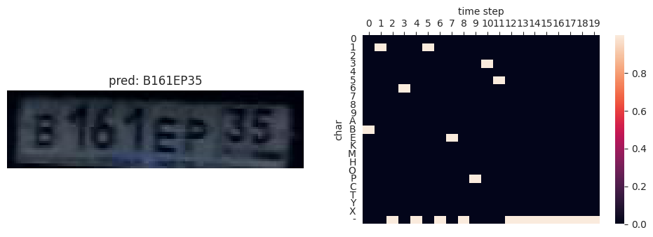

# Lisence Plate Text Recognition

Отчет по решению контеста на распознавание автономеров ([ссылка](https://www.kaggle.com/competitions/aimasters2023ml3hw4-license-plate-recognition)).

## Архитектура 

Я использовал CRNN ([ссылка](https://arxiv.org/abs/1507.05717)) вместе с efficient net ([ссылка](https://huggingface.co/timm/efficientnetv2_rw_s.ra2_in1k)) и трёхслойный GRU ([ссылка](https://pytorch.org/docs/stable/generated/torch.nn.GRU.html)). Кратко суть следующая:
1. Извлечь признаки с помощью CNN и получить тензор размера `(B,C,H,W)`
2. Подготовить признаки для подачи в RNN:
    1. Усреднить вдоль оси `H`, чтобы получить тензор размера `(B,C,W)`
    2. С помощью свёртки `1x1` вдоль оси `W` (а не `C` как по умолчанию) привести к фиксированной длине `T`
    3. В итоге нескольких перестановок осей получается тензор размера `(T,B,C)`
3. Подать последовательность в RNN
4. Произвести классификацию на `n_chars` символов для каждого элемента последовательности

Обучение на CTCLoss ([ссылка](https://pytorch.org/docs/stable/generated/torch.nn.CTCLoss.html)). Предсказание (декодирование тензоров вида `(T, n_chars)`) с помощью лучевого поиска ([ссылка](https://github.com/githubharald/CTCDecoder)). Оценка качества с помощью расстояния Левенштейна ([ссылка](https://lightning.ai/docs/torchmetrics/stable/text/edit.html))

В архитектуру efficient net я внес следующие изменения:
- в самой первой свёртке (под названием `conv_stem`) я изменил параметр `stride` с `(2,2)` на `(1,2)` с целью увеличить ширину итогового выхода из сети, чтобы `W` (ширина тензора на выходе из CNN) был близок к `T` (длина входа у RNN)
- в конце сети заменил `global_pool` и `classifier` на identity-преобразования

Архитектура GRU
- 3 слоя со скрытой размерностью 128
- на вход последовательность длины `T=20`
- `bidirectional=False`
- вариационный дропаут `0.3`([статья](https://arxiv.org/abs/1512.05287))

Более подробный конфиг:
```python
@dataclass
class CRNNConfig:
    cnn_input_size: Tuple[int, int] = (64, 320)
    rnn_sequence_len: int = 20
    cnn_output_features: int = 1792
    rnn_hidden_size: int = 128
    rnn_n_layers: int = 3
    alphabet: str = '0123456789ABEKMHOPCTYX'
    rnn_dropout: float = 0
    rnn_bidirectional: bool = False

    rnn_variational_dropout: float = 0.3
```

## Обучение

Всего 30 эпох с оптимизатором AdamW с косинусным прогревом и косинусным угасанием. Подробный конфиг:
```python
@dataclass
class LearnerConfig:
    max_lr: float = 1e-3
    lr_div_factor: float = 10
    batch_size: int = 32
    warmup_pct: float = 0.1
    weight_decay = 1e-2
    betas : tuple = (0.9, 0.999)
    lr_decay: bool = True
```
Для расшифровки этих параметров: [OneCycleLR](https://pytorch.org/docs/stable/generated/torch.optim.lr_scheduler.OneCycleLR.html).

Использовал аугментацию ColorJitter и нормализацию (посчитал статистики по датасету).

Сначала проводил эксперименты на разбиении, где трейн ~14K семплов и валидация ~10K семплов. Это дало лучшее качество на публичном лидерборде `0.10056`. Для финальных решений обучал на трейне ~23K с валидацией 1K. Лучшее качество на публичном лидерборде `0.02924`.

Обучал с помощью фреймворка Lightning ([ссылка](https://lightning.ai/)) локально на NVIDIA GeForce RTX 3060 Laptop 6GB и AMD Ryzen 7 5800H. Обученные веса: [ссылка](https://drive.google.com/file/d/15c-FUeIW58-DJELcHValCNwSEbL0XmuT/view?usp=sharing).

## Демо

Все предсказания для тестовой части: [ссылка](https://drive.google.com/file/d/19x8hf4MP5IwVYxEN8XGKQL8D1gDILOGW/view?usp=sharing).

Пара примеров предсказаний (первые пять семплов из тестовой выборки):





## Идеи, которые не сработали

- Использовать для предсказания символов выходы сразу со всех слоев RNN (переобучалось)
- Двуслойный трансформер вместо RNN (переобучалось, возможно стоило выставить дропаут побольше)
- Добавление LayerNorm/BatchNorm1d перед/после RNN (плохое качество)
- Добавление линейных слоев до/после RNN (плохое качество)
- Увеличение бекбона для CNN: пробовал resnet50, widereset50 (плохое качество)
- Убрать свертку вдоль `W` (плохое качество)
- Два слоя RNN (быстро сатурирует на плохом качестве)
- Четыре слоя RNN (плохое качество)
- Уменьшение lr для CNN (плохое качество)
