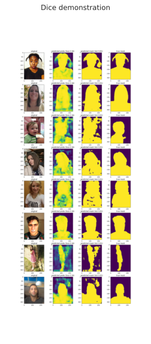

# UNet for Image Segmentation

Study project on training UNet ([Ronneberger et al., 2015](https://arxiv.org/abs/1505.04597), not too exact implementation) and LinkNet ([Chaurasia et al., 2017](https://arxiv.org/abs/1707.03718)). Main points of this project are
- comparison of LinkNet and UNet
- comparison of BCE loss and dice loss
- advanced logging via [Tensorboard](https://www.tensorflow.org/tensorboard)

## Demo

## Logging

На каждой итерации (`train.Model.log_iter()`):
- лосс и метрика на трейне
- для каждого свёрточного слоя
    - нормы весов и смещений
    - нормы градиентов по весам и по смещениям

После каждой эпохи (`train.Model.log_epoch()`):
- лосс и метрика на тесте
- чекпоинт параметров всей модели
- для каждого свёрточного слоя
    - гистограмма весов и смещений
    - гистограммы градиентов по весам и смещениям
- фигура с демонстрацией работы модели на изображениях `Model.pics_to_log_demonstration`
    - изображение
    - карта предсказанных вероятностей
    - предсказанная маска
    - истинная маска
- для каждого из блоков энкодера и декодера логируются активации каждого изображения из `Model.pics_to_log_activations` (как grayscale изображения)
- для каждого из блоков энкодера и декодера логируются активации каждого изображения из `Model.pics_to_log_gradients` (как grayscale изображения)

В конце обучения (`train.Model.log_final_model()`):
- гиперпараметры модели
    - оптимизатор
    - оптимизируемый критерий
    - число эпох
- метрики
    - финальные лосс и метрика
    - лучшие метрика и номер эпохи
- графовая структура нейросети