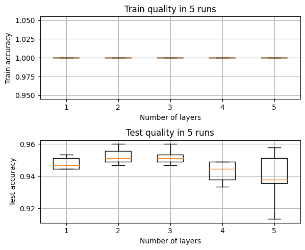
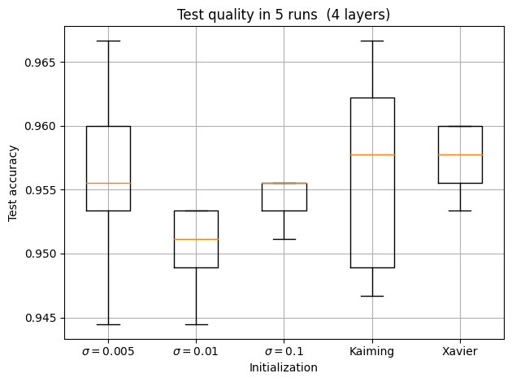
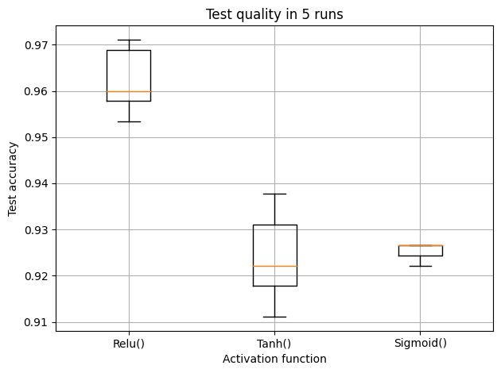

# Custom NN Modules with Numpy

**Implemenation.**
`layers.py` Numpy implementation of the following modules:
- ReLU
- Tanh
- Sigmoid
- Linear (Dense)
- LogSoftmax

`loss.py` Negative log likelihood.

**Optimizer.** I used `scipy.optimize.minimize` function with `L-BFGS-B` method.

**Experiments.** 

