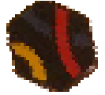
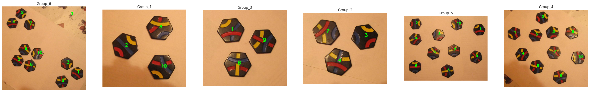

# Отчёт о практическом задании “Детекция и классификация фишек Тантрикс”

Алексеев Илья Алексеевич, 317 группа, ВМК МГУ им. М.В.Ломоносова.

## Общие сведения

Решена следующая задача: дана картинка, содержащая изображения нескольких фишек из игры Тантрикс, необходимо для каждой фишки добавить текстовую подпись с её типом. Референс:


## Решение

### Коллекция фишек

Из имеющихся фотографий была собрана коллекция фишек на белом фоне (на каждой картинке по одной фишке).


Код представлен в ноутбуке make_sample.ipynb. Основные использованные инструменты:

- поиск контуров [cv2.findContours()](https://docs.opencv.org/3.4/d3/dc0/group__imgproc__shape.html#ga17ed9f5d79ae97bd4c7cf18403e1689a)
- аппроксимация многоугольником [cv2.approxPolyDP()](https://docs.opencv.org/4.x/d3/dc0/group__imgproc__shape.html#ga0012a5fdaea70b8a9970165d98722b4c)

Коллекция составила 58 изображений.

### Разметка данных

Полученная коллекция

- размечена вручную на 10 классов (разметка содержится в названии файла)
- дополнена классом 11: объекты, которые похожи на фишки, но фишками не являются (несколько примеров ниже)


Первые три картинки не являются фишками по очевидным причинам. Четвёртая не является фишкой потому, что конкретно такого пересечения линий нет среди данных в задании фишек.

- также в класс 11 добавлены картинки из интернета: логитипы, узоры — цветные и однотонные, а также мемы

Размеченная коллекция была поделена на обучающую выборку (76 объектов, data/train) и тестовую выборку (37 объектов, data/test).

### Классификатор

Построена и обучена нейросеть для классификации: на вход подается изображение (3,16,16) из размеченной выборки, на выходе — вероятности принадлежности классам 1..11. 

- Архитектура из двух VGG блоков и логистической регрессии (обучаемых параметров: 68621)

```python
VGGBlock = torch.nn.Sequential(
    nn.Conv2d(in_channels, out_channels, kernel_size=3, padding=1),
    nn.BatchNorm2d(out_channels),
    nn.Conv2d(out_channels, out_channels, kernel_size=3, padding=1),
    nn.ReLU(),
    nn.MaxPool2d(kernel_size=2),
    nn.BatchNorm2d(out_channels)
)

VGG = nn.Sequential(OrderedDict([
    ('vgg1', VGGBlock(3, 30)),
    ('vgg2', VGGBlock(30, 60)),
    ('flatten', nn.Flatten()),
    ('clf', nn.Linear(960, 11))
]))
```

### Аугментация

Необходима агрессивная аугментация, чтобы значительно разнообразить обучающую выборку. Исходное изображение:


Использованы следующие преобразования:

- поворот фишки на случайный угол из диапазона (-180, 180)



- случайный сдвиг изображения (shear) на случайный угол из диапазона (-15, 15)


- добавление шума Гаусса со стандартным отклонением 0.05


- удаление случайного прямоугольника из изображения


- колебание цвета, яркости, контраста


- размытие Гаусса с ядром (3,3) и стандартным отклонением 0.5


### Обучение нейросети

Гиперпараметры обучения:

- Число эпох: 2000 
- Оптимизатор: Adam с темпом обучения 1e-3
- Размер батча: 19
- Loss: кросс-энтропия

### Случай неуверенных предсказаний

Если нейросеть дает предсказание, далекое от уверенного, то индикатором этого может стать энтропия выданного распределения: если она больше некоторого порога (выбран порог 0.5), то объект причисляется к классу 11 (“мусорному” классу).

## Тесты

### Пайплайн тестирования

Чтобы применить разработанное решение к конкретному изображению, нужно

- получить изображения отдельных шестиугольников на белом фоне с помощью функции `get_hexagons()`
- загрузить веса обученной модели (файл `model.pth`)
- дать на вход функции `put_labels()` полученные изображения

### Тестовый датасет

Описанное решение дает 100% точность на тестовом датасете (data/test, 37 объектов):


Чтобы посмотреть каждый пример по отдельности, нужно приблизить данный pdf-файл (простите).

### Мемы и мимикрирующие фишки

Описанное решение дает 100% точность на “мемном” датасете (data/random, 9 объектов):


Обратим внимание на 4, 8, 9. Это фигуры, которые по форме и набору цветов похожи на фишки, но ими не являются. Эти три примера были главным камнем преткновения на протяжении всего решения:

- 4 пример с большой уверенностью классифицировался как фишка из-за наличия темного цвета
- 8, 9 примеры  — из-за наличия всех трех цветов

Когда стало ясно, что нельзя обучить сеть правильно классифицировать такие объекты просто увеличив число эпох, было принято два решения, которые и привели к отличным результатам:

- добавить в датасет больше примеров класса 11
- сделать аугментацию более агрессивной (увеличить интервалы изменения углов, сигм и т.п.)

### Аугментированный тестовый датасет

Для обученной сети самой сложной задачей, очевидно, является задача где нужно аугментировать тестовую выборку. Описанное решение дает 100% точность даже здесь.


### Исходные картинки

На всех картинках Single, Group и на картинке Dozen_0 решение дает правильные ответы.





Всего одна ошибка: на картинке Group_6 мелкий узор на скатерти воспринимается как фишка 3.

## Итоги

Общий подход к решению таков:

- детекция шестиугольников с помощью средств `opencv`
- классификация шестиугольников с помощью свёрточной нейросети
- т.к. задача достаточно проста и датасет весьма беден на примеры, то
  - агрессивная аугментация
  - добавление собственных примеров на основе анализа ошибок классификатора

