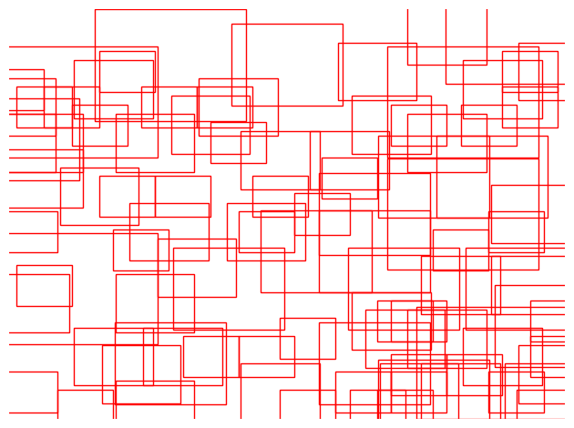

# Single Shot Detector with VGG and ResNet

This is a study object-detection project on implementing SSD ([Liu et al., 2015](https://arxiv.org/abs/1512.02325)) and testing it for cars and license plates detection. 

**SSD.** Prior box (anchor) utilities are located in `src/boxes`. Multibox loss is implemented at `src/loss.py`. The SSD model itself is implemented at `src/models/resnet18.py` and `src/models/vgg16.py`.

**Detection Algorithm.** Если в двух словах, алгоритм следующий:
- пропустить изображение через свёрточную сеть
- собрать промежуточные активации с нескольких слоев (среди [этих строк](https://github.com/voorhs/dl-practice/blob/main/object-detection/src/models/resnet18.py#L34-L44) такие слои отмечены решёткой)
- на каждой промежуточной активации каждому "пикселю" соответствует априорный box, поэтому со всех фичермап признаки этого пикселя подаются в два классификатора
    - первый классификатор предсказывает класс объекта
    - второй классификатор предсказывает поправки к априорным параметрам box'а 

Визуализация части таких априорных боксов:



На этапе обучения, полученные предсказания (которых очень много, т.к. априорных box'ов много) матчатся с теми истинными box'ами, с которыми они перескаются больше всего и с которыми мера IoU больше установленного порога. Иначе назначается нулевой класс "фон". Для каждого априорного бокса, для которого нашелся таргет бокс, считается localization loss, и для всех боксов считается classification loss. Подробнее в `src/loss.py`.

На этапе инференса, полученные предсказания обрабатываются алгоритмом non-maximum supression ([torch docs](https://pytorch.org/vision/main/generated/torchvision.ops.nms.html)).

Подробнее в `src/learner.py`.

**Data.** 5563 train samples and 272 validation samples. Example:


**VGG.** Undertrained VGG model results:


**Resnet18.** Как я собирал модель.
- конфиг можно посмотреть в файле `src/boxes/config.py`
- убрал все дополнительные aspect ratio (все мои якоря только 1:1)
- убрал фичер мапу с самым большим разрешением
- добавил в extra layers в пару мест макспулинг так, чтобы убрать фичермапы для среднего масштаба -- остались только для мелких деталей (авто номера) и больших объектов (автомобили)
- итоговые фичермапы: `[(23,40), (11,19), (2,4), (1,2), (1,2)]`
- Все описанные модификации вылились в число якорей: 2282. Это достаточно мало, у меня была цель облегчить обучение.


More examples at `hw3.ipynb`.

**Evaluation.** Mean average precision with [torchmetrics](https://lightning.ai/docs/torchmetrics/stable/detection/mean_average_precision.html):

```
'map': tensor(0.2822),
'map_50': tensor(0.6905),
'map_75': tensor(0.2104),
'map_small': tensor(0.2822),
'mar_1': tensor(0.1659),
'mar_10': tensor(0.3733),
'mar_100': tensor(0.3733),
'mar_small': tensor(0.3733),
```

