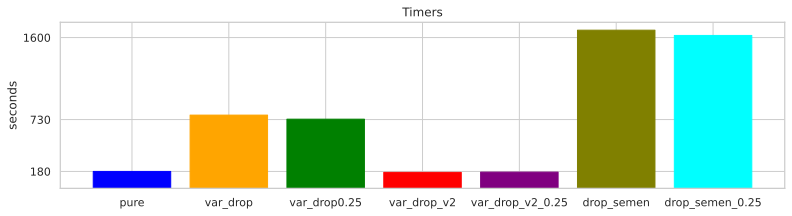
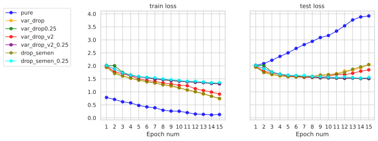
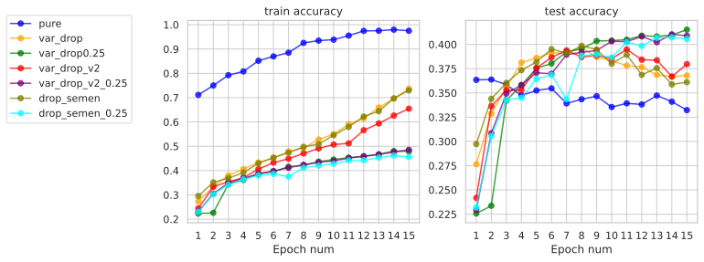

# RNN for Text Classification and Language Modeling

Implementing dropout techniques for LSTM:
- variational dropout ([Gal & Ghahramani, 2015](https://arxiv.org/abs/1512.05287))
- recurrent dropout ([Semeniuta et al., 2016](https://aclanthology.org/C16-1165/))

Timer measurements (each dropout is tested with $p=0$ and $p=0.25$):



It kinda works :) but I'm not really sure about correctness of implemented algorithms because of the following plots for text classification on [large movie review dataset](https://ai.stanford.edu/~amaas/data/sentiment/):





Examples of text generation (top-10 sampling):

```
<sos> movie awesome one favorite movies ever made <unk> movie one better acting <unk> <unk> plot ridiculous special effects <unk> <eos>
<sos> <unk> favorite movie ever seen one movies one worst movie ever seen one <unk> acting good movie bad acting terrible acting bad direction
<sos> <unk> best movie ever seen <unk> saw movie really bad good bad <unk> movies like movies like movie one <eos>
<sos> <unk> worst movie ever seen dont know much one best thing ever made movie <unk> acting terrible direction directing cinematography directing story <eos>
<sos> authors bless film student <unk> <unk> <unk> <unk> <unk> <unk> <unk> <unk> <unk> <unk> made much better film one greatest films year later
```
