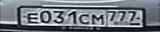

# Seq2seq Transformer for Optical Character Recognition

This is a study project on implementing transformer ([Vaswani et al., 2017](https://arxiv.org/abs/1706.03762)) for OCR on car licence plates.

**Transformer.** The implementation of seq2seq transformer is located in `src/models/transformer`. I took inspiration from MPNet ([Song et al., 2020](https://arxiv.org/abs/2004.09297)) at Hugging Face ([modeling_mpnet.py](https://github.com/huggingface/transformers/blob/31d452c68b34c2567b62924ee0df40a83cbc52d5/src/transformers/models/mpnet/modeling_mpnet.py)).

**OCR algorithm.** It's simple and straightforward:
I employed concept of CRNN ([Shi et al., 2015](https://arxiv.org/abs/1507.05717)) with resnet18 ([timm](https://huggingface.co/docs/timm/models/resnet)), but replaced encoder RNN with seq2seq transformer, which generates prediction in autoregressing manner. In short, the point is this:
1. Extract features with CNN ang get tensor of shape `(B,C,H,W)`
2. Make a sequence out of extracted features:
    1. Average pool along `H` dim -> `(B,C,W)`
    2. Apply conv `1x1` along `W` dim (not `C` as usual) result in fixed length `T` -> `(B,T,C)`
3. Feed sequence to transformer

**Resnet.** I made the following changes to resnet18:
- in the very beginnin, I changed stride of `conv1` from `(2,2)` to `(1,2)` in order to widen output tensor
- in the very end, I replaced `global_pool` and `fc` to identity

**Data.** 23546 samples:




**Training.** 16 epochs with AdamW took 10 minutes on GeForce RTX 3060 Laptop with the following parameters:

```python
@dataclass
class LearnerConfig:
    max_lr: float = 2e-5
    lr_div_factor: float = 10
    batch_size: int = 16
    warmup_pct: float = 0.1
    weight_decay = 1e-2
    betas : tuple = (0.9, 0.999)
    lr_decay: bool = True
```

On parameter names meaning: [OneCycleLR](https://pytorch.org/docs/stable/generated/torch.optim.lr_scheduler.OneCycleLR.html). Training is carried out using [Lighting](https://lightning.ai/).

**Evaluation.** Levenshtein edit distance ([torchmetrics](https://lightning.ai/docs/torchmetrics/stable/text/edit.html)) and CrossEntropyLoss ([torch](https://pytorch.org/docs/stable/generated/torch.nn.functional.cross_entropy.html)):

```
val_edit_distance       0.0376984141767025
    val_loss            0.01966817118227482
```

It's a local validation of 1000 samples from labeled part of the dataset.
